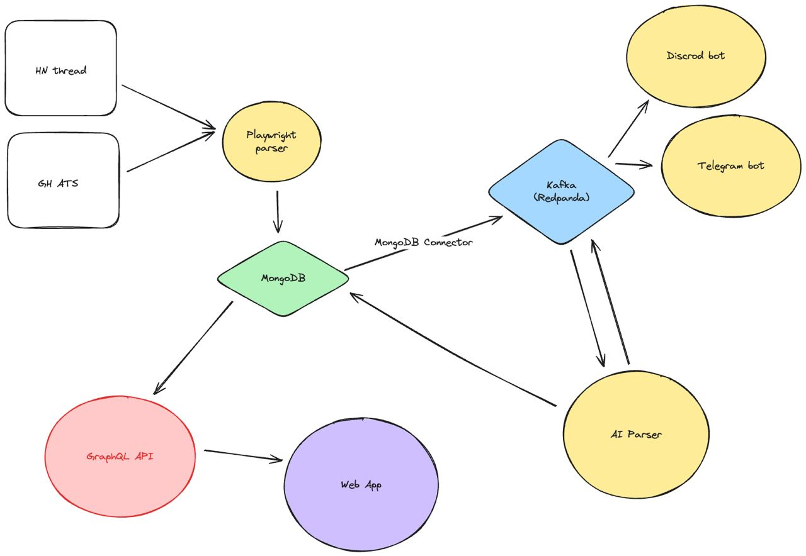

# WhoIsHiring

## Overview

WhoIsHiring is an automated pipeline designed to scrape job postings from different sources using Playwright, store the raw data in MongoDB, and process it using an AI parser. The parsed data is then consumed by various clients, including Telegram and Discord bots, as well as a web frontend, delivered via Redpanda (Kafka).

## Architecture



-   Website with the content: The starting point where job postings are sourced.
-   Playwright Parser: An automation tool that collects job postings data.
-   MongoDB: A NoSQL database where raw job postings data is stored.
-   MongoDB Connector: Connects MongoDB to the Kafka stream.
-   Kafka (Redpanda): A distributed streaming platform that manages data flow between components.
-   AI Parser: Processes and analyzes raw job data.
-   Clients:
    -   Telegram Bot: Sends updates and notifications to Telegram users.
    -   Discord Bot: Sends updates and notifications to Discord users. (TODO)
    -   Frontend: A web interface for users to interact with the parsed job data.(TODO)

## Features

-   Automated Scraping: Seamlessly scrape job postings from websites.
-   Data Storage: Efficiently store raw data in MongoDB.
-   Stream Processing: Utilize Kafka (Redpanda) for data streaming.
-   AI Parsing: Leverage AI to process and analyze job data.
-   Multi-Client Support: Deliver processed data to Telegram, Discord, and a web frontend.

## Installation

1. Clone the repository:

    ```bash
    git clone https://github.com/JulyJ/whoishiring.git
    cd whoishiring
    ```

2. Install dependencies

    ```bash
    npm install
    npx playwright install --with-deps
    ```

3. Copy the .env.example files to .env for each project and update them with your specific configuration.

    ```bash
    cp .env.example .env
    ```

4. Run build

    ```bash
    npx turbo build
    ```

5. For each service in the project that has its own Dockerfile, you’ll need to build and run the Docker containers. Below are example for how to do this:

    ```bash
    cd apps/playwright-parser
    docker build -t whoishiring-playwright-parser
    docker run -d --name whoishiring-playwright-parser
    ```

6. To run the run-parser.sh script with different parameters using Docker, you can add a specific section:

    ```bash
    docker run --rm whoishiring-parser ./run-parser.sh gh
    ```

7. To stop and remove the containers once you are done, you can use:

    ```bash
    docker stop whoishiring-playwright-parser
    docker rm whoishiring-playwright-parser

    ```
